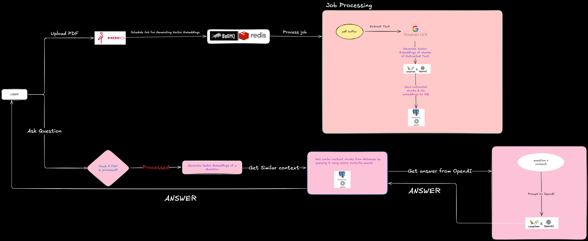

# Question Answer Application

Welcome to the Question Answer Application! This project is designed to provide a robust and scalable solution for generating and answering questions using advanced AI models and Retrieval Augmented Generation (RAG). The application leverages a variety of technologies to ensure efficient data handling, storage, and processing.

This project also includes a rate limiter based on the token bucket algorithm using Redis. This ensures fair usage and prevents abuse of the API by limiting the number of requests a user can make within a certain time frame for resource intensive APIs.

## Architecture Diagram


## Tech Stack

- **LangChain**: Framework for developing applications powered by large language models (LLMs).
- **OpenAI Model**: For generating embeddings and answering questions.
- **Tesseract OCR**: Utilized for extracting text from PDF documents through Optical Character Recognition.
- **BullMQ**: Simple Queue for asynchronous processing of PDF files.
- **PgVector**: For efficient vector similarity search.
- **Minio**: For file uploads and storage.
- **Docker**: For containerization and easy deployment.
- **Redis**: For rate limiting

## Getting Started

### Prerequisites

- Docker and Docker Compose installed on your machine.
- A valid OpenAI API key for generating embeddings and answering questions.

### Demo
- [Demo Link](https://www.loom.com/share/10131cbae97642de9f493e09c2dbb5df?sid=0f7fe009-000a-4f87-ad0f-f699c7d8f4f5)

### Installation

1. **Clone the repository**:
  ```sh
  git clone https://github.com/vikaskamblenitp/question-answer-app
  cd question-answer-app
  ```

2. **Setup environment variables**:
  - Copy the example environment file:
    ```sh
    cp .env.example .env
    cp .env.example .env.local
    ```
  - Update `.env` and `.env.local` with your configuration, including `CONFIG_OPEN_API_KEY`.

3. **Run required containers for the project**:
  ```sh
  docker-compose up -d
  OR
  docker-compose up -d --build
  ```

1. **Scripts for Database migrations**:
  ```sh
  npm run migrate:up ## up the db migrations
  npm run migrate:create <file_name> ## file name
  npm run migrate:down ## down the script
  ```

1. **Start the application**:
  - Disclaimer: for OCR we will need some system dependencies like graphicsmagick ghostscript. So I would prefer to use dockerized application which will do that thing for us
  ```sh
  npm run dev ## this can be used for all other APIs except PDF processing
  OR
  docker-compose up -d --build ## Prefer this if you want to upload file
  ```

### API Endpoints

- **PDF processing**: `/api/v1/documents`
- **Processing status and details**: `/api/v1/documents/:documentID`
- **Get answers for question on a file**: `/api/v1/qa/file/:fileID/answer`
- **Get all Q&A history for a file**: `/api/v1/file/:fileID`
  
Below endpoints are temporary and will be replaced with Google SSO login in future updates
- **Login**: `/api/v1/users/login`
- **Register**: `/api/v1/users/register`.


## Future Enhancements

- **Google SSO Login**: To provide a seamless and secure login experience.

## Contributing

Contributions are welcome! Please fork the repository and create a pull request with your changes.

## License

This project is licensed under the MIT License.

## Contact

For any inquiries or job opportunities, please contact me via [LinkedIn](https://www.linkedin.com/in/vikas-kamble07), [Email](mailto:vikasmkamble007@gmail.com).

---

Thank you for checking out the Question Answer Application! Your feedback and contributions are highly appreciated.
